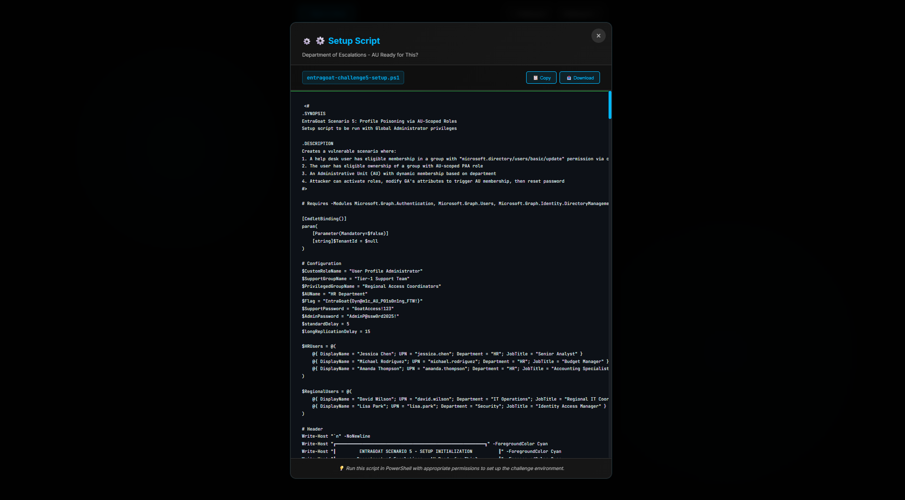

# EntraGoat - A Deliberately Vulnerable Entra ID Environment


**EntraGoat** is a deliberately vulnerable Microsoft Entra ID infrastructure designed to simulate real-world identity security misconfigurations and attack vectors. EntraGoat introduces intentional vulnerabilities in your environment to provide a realistic learning platform for security professionals. It features multiple privilege escalation paths and focuses on black-box attack methodologies.

EntraGoat uses PowerShell scripts and Microsoft Graph APIs to deploy vulnerable configurations in your Entra ID tenant. This gives users complete control over the learning environment while maintaining isolation from production systems.


## 🚀 Getting Started

### Prerequisites
- A Microsoft Entra ID tenant (Recommended: a test/trial tenant)
- Global Administrator privileges
- Microsoft Graph PowerShell SDK
- Node.js, npm

### Installation

EntraGoat provides an interactive web interface for challenge management and PowerShell scripts for infrastructure deployment.

#### Method 1: Quick Setup (Recommended)

1. **Clone the repository**
   ```bash
   git clone https://github.com/Semperis/EntraGoat
   cd EntraGoat
   ```

2. **Install Microsoft Graph PowerShell SDK**
   ```powershell
   Install-Module Microsoft.Graph -Scope CurrentUser -Force
   ```

3. **Run the web interface**
   ```bash
   npm install
   npm start
   ```

4. **Access EntraGoat at** `http://localhost:3000`

5. **Run the Setup Script for each given scenario**

#### Method 2: Manual PowerShell Setup

For individual scenarios, navigate to the specific challenge directory:

```powershell
cd scenarios
.\EntraGoat-Scenario1-Setup.ps1 -Verbose
```

## 🎯 Challenge Structure

Each scenario includes:
- **📋 Setup Script** - Deploys vulnerable configuration
- **🧹 Cleanup Script** - Removes all created objects
- **📖 Solution Walkthrough** - Step-by-step attack demonstration
- **🎌 Capture the Flag** - Hidden flags to discover

## 💰 Pricing

EntraGoat scenarios run entirely within your existing Entra ID tenant and do not incur additional Microsoft licensing costs. The vulnerabilities are created through configuration changes only.

**Note:** Use a dedicated test tenant to avoid impacting production environments.

## 👥 Contributors

- **Jonathan Elkabas** - Security Researcher @Semperis
- **Tomer Nahum** - Security Research Team Lead @Semperis

## 🎯 Presented at

- **Black Hat USA 2025** - Arsenal
- **DEF CON 33** - Demo Labs

## 📚 Solutions

⚠️ **Spoiler Alert!** Solution files contain complete attack walkthroughs.

Solution guides are available in the `solutions/` directory for each scenario:
- Detailed step-by-step attack procedures
- PowerShell automation scripts

## 🖼️ Screenshots

### Main Dashboard


### Challenge Interface


### PowerShell Setup



## 🤝 Contribution Guidelines

We welcome contributions from the security community:

- **New Scenarios** - Additional attack vectors and privilege escalation chains
- **Code Improvements** - PowerShell script optimization and error handling
- **Documentation** - Enhanced learning materials and walkthroughs
- **Bug Reports** - Issue identification and resolution
- **Feature Requests** - New functionality and improvements

## ⚠️ Disclaimer

**For Educational Purposes Only**

EntraGoat is designed exclusively for educational and authorized security testing purposes. Users are responsible for:
- Obtaining proper authorization before testing
- Using dedicated test environments only
- Complying with applicable laws and regulations
- Following responsible disclosure practices

The authors assume no liability for misuse of this tool.

---

**Happy Hunting!** - The EntraGoat Team
